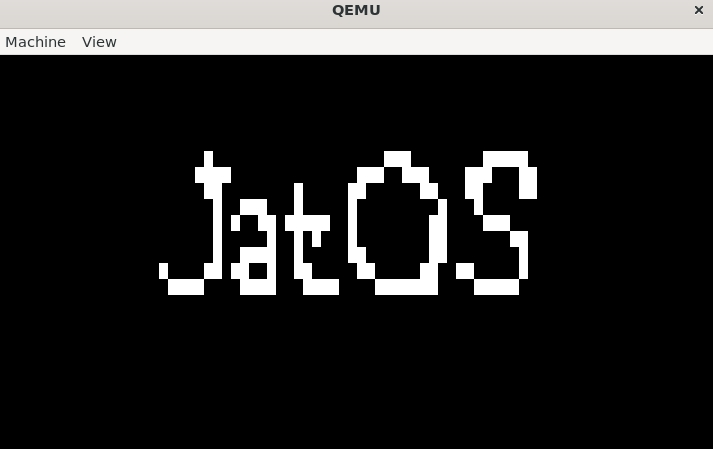
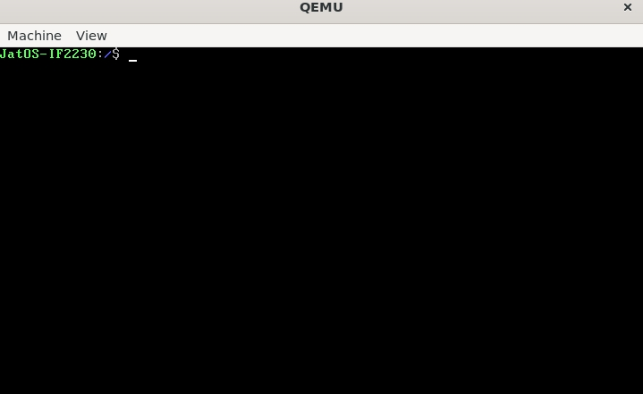
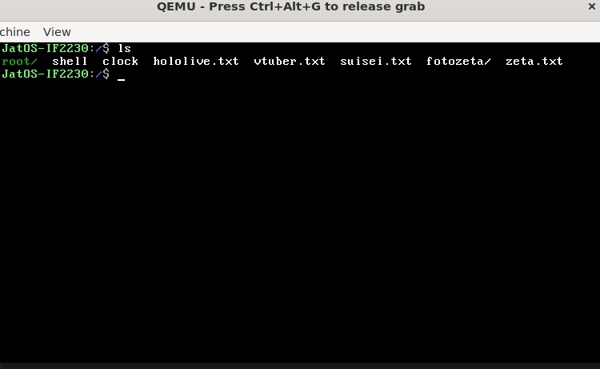
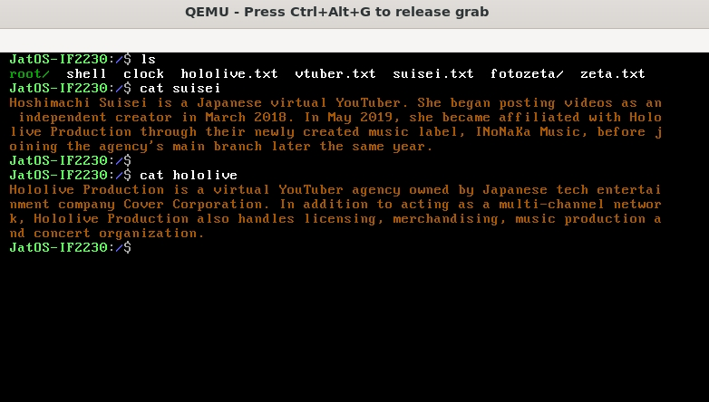
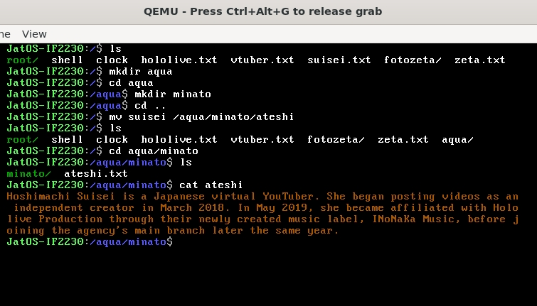
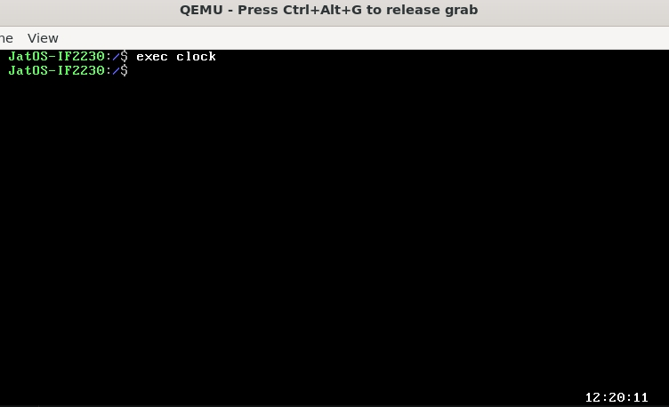

# TUGAS BESAR SISTEM OPERASI - IF2230 
- Milestone 0: Pembuatan Sistem Operasi x86, Toolchain, Kernel, dan GDT

- Milestone 1: Pembuatan Sistem Operasi x86, Interrupt, Driver, dan Filesystem

- Milestone 2: Pembuatan Sistem Operasi x86, Paging, User Mode, dan Shell

- Milestone 3: Pembuatan Sistem Operasi x86, Process, Scheduler, Multitasking


## Table of Contents
* [Requirements](#requirements)
* [Run Locally](#run-locally-in-windows-using-vscode)
* [Command List](#command-list)
* [Contributors](#contributors)
* [Screenshots](#screenshots)

## Requirements
 1. Netwide assembler (Compiler assembly utama)
 2. GNU C Compiler (Compiler C utama untuk sistem operasi)
 3. GNU Linker (Linker object code hasil kompilasi)
 4. QEMU - System i386 (Emulator utama untuk menjalankan sistem operasi)
 5. GNU Make (Build tools untuk sistem operasi)
 6. genisoimage (Tool untuk pembuatan image sistem operasi)
 7. Sistem Operasi Ubuntu 20.04/22.04
 8. Visual Studio Code


## Run Locally in Windows using VSCode

Clone the project

```bash
  git clone https://github.com/labsister21/os-2024-jatos.git
```

Go to the project directory

```bash
  cd <project path>
```

On terminal

```bash
  wsl
```

Install the dependencies

```bash
  sudo apt update
  sudo apt install -y nasm gcc qemu-system-x86 make genisoimage gdb
  sudo apt install gcc
  code --install-extension ms-vscode.cpptools-extension-pack
  code --install-extension ms-vscode-remote.remote-wsl    
```

To run, open VScode on wsl using
```bash
code .
```
then click F5 or Shift + F5

OR

On wsl terminal,
```bash
qemu-system-i386 -s -S -drive file=$(DISK_NAME).bin,format=raw,if=ide,index=0,media=disk -cdrom $(ISO_NAME).iso
```
## Command List
- cd	- Mengganti current working directory (termasuk .. untuk naik)
- ls	- Menuliskan isi current working directory
- mkdir	- Membuat sebuah folder kosong baru pada current working directory
- cat	- Menuliskan sebuah file sebagai text file ke layar (Gunakan format LF newline)
- cp	- Mengcopy suatu file (Folder menjadi bonus)
- rm	- Menghapus suatu file (Folder menjadi bonus)
- mv	- Memindah dan merename lokasi file/folder
- find	- Mencari file/folder dengan nama yang sama diseluruh file system
- exec	- Menjalankan program yang ada pada filesystem
- ps	- Menampilkan informasi proses pada sistem
- kill <pid> - Melakukan terminasi proses berdasarkan pid

## Contributors

- Muhammad Zaki - 13522136
- Ahmad Rafi Maliki - 13522137
- Andi Marihot Sitorus - 13522318
- Nicholas Reymond Sihite - 13522144

## Screenshots

- Booting Screen



- Screenshot 1



- Screenshot 2



- Screenshot 3



- Screenshot 4



- Screenshot 5




